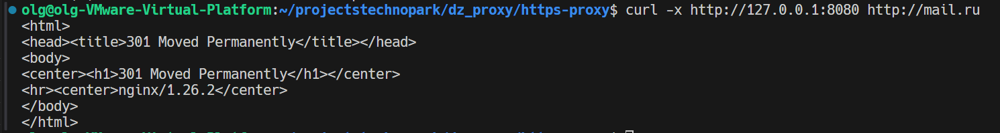

# Oleg Muzalev HTTPS PROXY

## Все запросы на которых проверялась работоспособность в requests.txt  

### Сертификаты в certs/ выложены потому что ценности не представляют но генерировать их на ходу гораздо сложнее

## Запуск

docker build . -t https-proxy
docker run -d -p 8080:8080 -p 8000:8000 https-proxy

Небольшой пример работоспособности  

