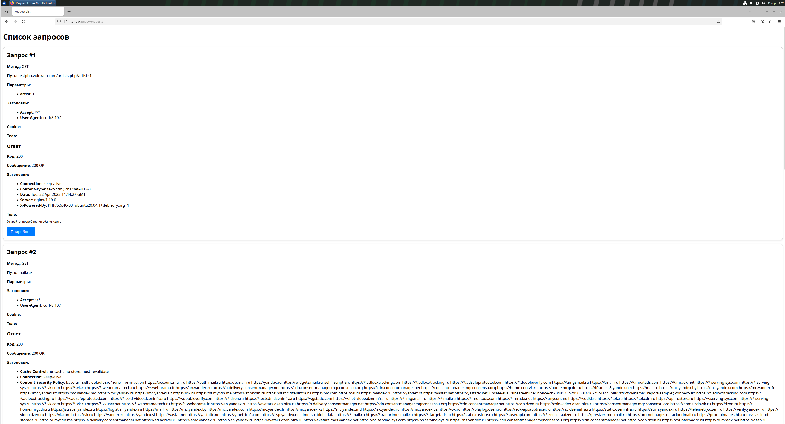
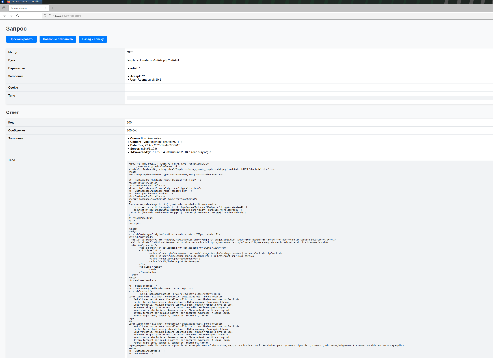
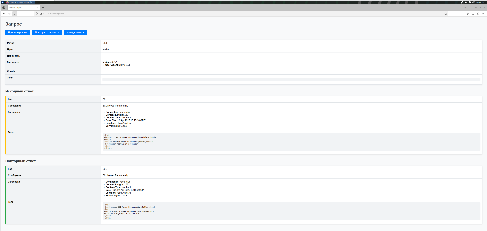
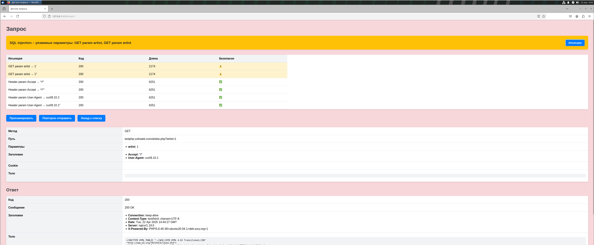
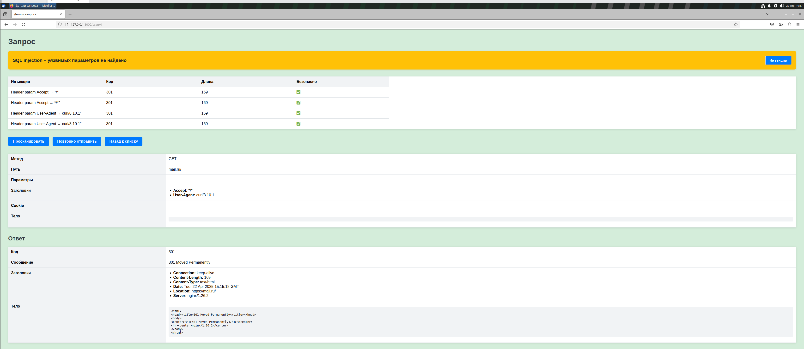

# Oleg Muzalev HTTPS PROXY

## Все запросы на которых проверялась работоспособность в requests.txt  

## Запуск

docker build . -t https-proxy  
docker run -d -p 8080:8080 -p 8000:8000 https-proxy

## Примеры использования

### Главная страница (http://127.0.0.1:8000/requests)

тут отображается весь список выполненных запросов, нажав подробнее можно перейти на подробную страницу запроса  

### Подробная страница запроса (http://127.0.0.1:8000/requests/1)

Здесь можно посмотреть все параметры запроса и ответа, а также перейти к сканированию уязвимостей или повторной отправке запроса, а также вернуться на страницу со списком всех запросов

### Страница повторной отправки запроса (http://127.0.0.1:8000/repeat/4)

Здесь можно посмотреть запрос и ответ, который был записан в базу данных (подчеркнут желтым) и новый ответ (подчеркнут зеленым)  

### Пример поиска уязвимости к SQL инъекциям (http://127.0.0.1:8000/scan/1)

Если в get параметры добавить кавычку то будет SQL ошибка на сайте  
http://testphp.vulnweb.com/artists.php?artist=1  

На сайте фон становится красным и в таблице опробованных инъекций уязвимые параметры будут обозначены соответствующим значком   
  

Также если все корректно то будет зеленая подсветка и нажав "инъекции" можно увидеть список протестированных инъекций
  

### Сертификаты в certs/ выложены потому что ценности не представляют но генерировать их на ходу гораздо сложнее 